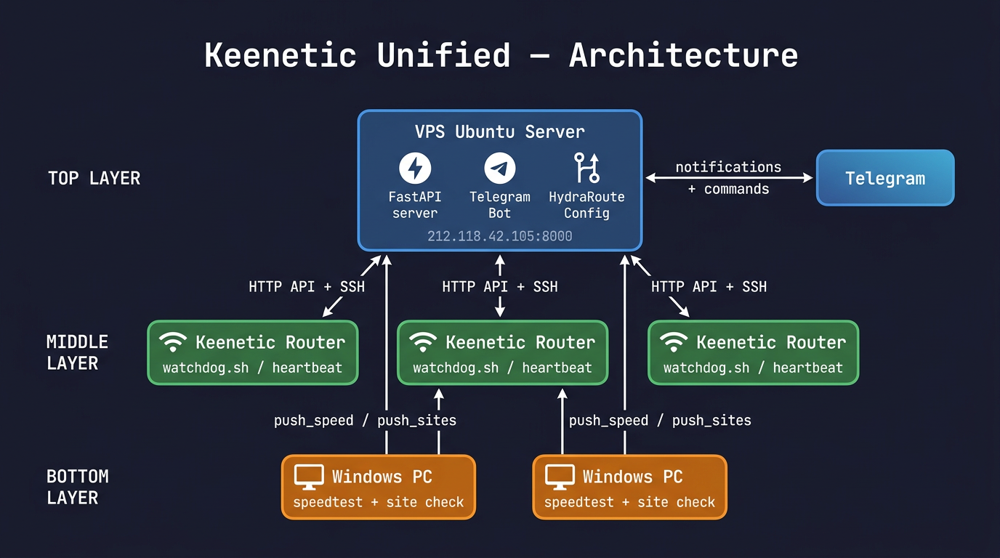
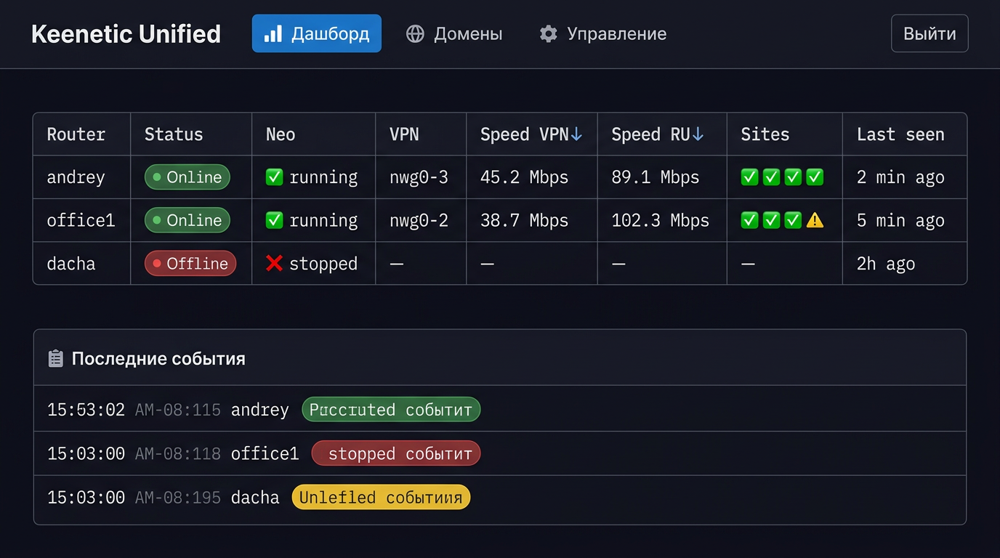
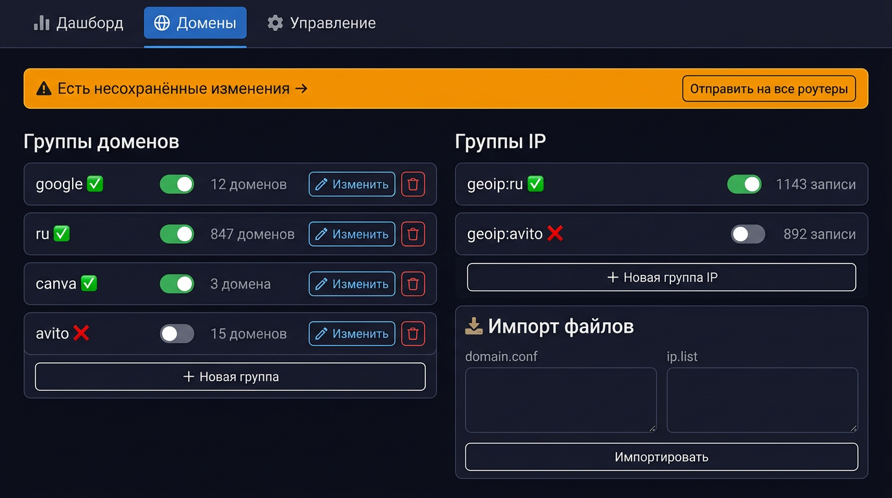

# 📡 Keenetic Unified

Система мониторинга и управления роутерами Keenetic и Windows-ПК через веб-интерфейс и Telegram.



---

## Возможности

- **Веб-дашборд** — статус онлайн/офлайн, скорость VPN и RU, Neo, сайты, события
- **Telegram-бот** — SSH-команды, статус, перезагрузка, массовые операции
- **HydraRoute Neo** — единая конфигурация доменов и IP на все роутеры сразу
- **Мониторинг сайтов** — canva, instagram, netflix, youtube с Windows-ПК
- **Авто-восстановление** — watchdog перезапускает Neo и Entware при сбоях
- **Уведомления** — Telegram + Email, максимум 3 на инцидент
- **Авторизация** — все страницы и операции защищены паролем
- **Поддержка 20+ объектов** — роутеры и ПК регистрируются автоматически

---

## Архитектура

```
┌─────────────────────────────────────────┐
│         VPS Ubuntu Server               │
│   FastAPI + Telegram Bot + HydraRoute   │
│         http://IP:8000                  │
└────────────┬──────────────┬─────────────┘
             │ HTTP API+SSH  │ HTTP API+SSH
    ┌────────▼──────┐  ┌────▼────────────┐
    │ Keenetic      │  │ Keenetic        │  (20+ роутеров)
    │ Router        │  │ Router          │
    │ watchdog.sh   │  │ watchdog.sh     │
    └────────┬──────┘  └────┬────────────┘
             │               │
    ┌────────▼──────┐  ┌────▼────────────┐
    │ Windows PC    │  │ Windows PC      │  (опционально)
    │ speedtest     │  │ speedtest       │
    │ site checks   │  │ site checks     │
    └───────────────┘  └─────────────────┘
```

**Поток данных:**
- Роутер → сервер: heartbeat каждые 60 сек, watchdog-отчёты
- ПК → сервер: статус сайтов каждые 30 мин, скорость каждые 4 часа
- Сервер → роутер: SSH-команды, обновление HydraRoute конфига
- Сервер → Telegram: уведомления об инцидентах

---

## Веб-интерфейс



### 📊 Дашборд `/`
Главная страница. Обновляется автоматически каждые 30 сек.

| Колонка | Описание |
|---|---|
| Router | Имя + ссылка на веб-морду роутера |
| Status | 🟢 Online / 🔴 Offline |
| Neo | ✅ running / ❌ stopped |
| VPN | Активные туннели: nwg0, nwg1... |
| Speed VPN↓ | Скорость загрузки через VPN (Mbps) |
| Speed RU↓ | Скорость прямого RU-канала (Mbps) |
| Sites | ✅/❌ для canva, instagram, netflix, youtube |
| Last seen | Время последнего heartbeat |

Снизу — лента последних событий (падения, восстановления, предупреждения).

### 🌐 Домены `/domains`



Управление HydraRoute Neo конфигурацией:
- Группы доменов и IP с переключателями вкл/выкл
- Редактирование, добавление, удаление записей
- Импорт `domain.conf` и `ip.list` с роутера
- Кнопка **"Отправить на все роутеры"** — применяет конфиг через SSH

При несохранённых изменениях появляется оранжевый баннер.

### ⚙ Управление `/admin`

- Список роутеров с настройкой IP, SSH-логина/пароля, веб-ссылки
- Секция **"SSH на всех роутерах"** с быстрыми кнопками: `opkg update`, `uptime`, `neo status`
- Секция **"Проверка уведомлений"** — тест Telegram + Email
- Вывод результатов SSH: имя хоста, exit-код, stdout, stderr

---

## Установка

### 1. Сервер (Ubuntu 22/24 LTS)

**Требования:**
- Ubuntu 22.04 или 24.04
- Python 3.10+
- `sshpass` (устанавливается автоматически)
- Открытый порт 8000 (UFW)

```bash
# Клонировать репозиторий
git clone https://github.com/andrey271192/Keenetic-Unified.git /opt/keenetic-unified
cd /opt/keenetic-unified

# Установить зависимости и systemd-сервис
bash server/install.sh

# Настроить окружение
cp server/.env.example server/.env
nano server/.env
```

**Файл `server/.env`:**
```env
HOST=0.0.0.0
PORT=8000
ADMIN_PASSWORD=твой_пароль

# Telegram (обязательно для уведомлений)
TELEGRAM_TOKEN=токен_бота
TELEGRAM_CHAT_ID=твой_chat_id

# Email (опционально)
SMTP_HOST=smtp.gmail.com
SMTP_PORT=587
SMTP_USER=почта@gmail.com
SMTP_PASS=пароль_приложения
SMTP_TO=куда@отправлять.ru
```

```bash
# Запустить
systemctl restart keenetic-unified
systemctl status keenetic-unified

# Открыть порт в файрволе
ufw allow 8000/tcp
```

**Сервер запустится на** `http://IP:8000`

**Обновление сервера:**
```bash
cd /opt/keenetic-unified && git pull && systemctl restart keenetic-unified
```

---

### 2. Роутер (Keenetic + Entware)

**Требования:**
- Роутер Keenetic с поддержкой Entware
- Установленный Entware (`opkg`)
- HydraRoute Neo — встроен в прошивку Keenetic (активировать в настройках)
- SSH-доступ к роутеру (включить в Keenetic: Управление → SSH)
- Открытый SSH-порт 22 с WAN (для управления с сервера)

**Что устанавливает скрипт:**
- `watchdog.sh` — мониторинг Neo и VPN-туннелей, авто-перезапуск
- `watchdog_heartbeat.sh` — отправляет статус на сервер каждые 60 сек
- `hydra_update.sh` — скачивает конфиг HydraRoute с сервера
- cron-задания для всех скриптов

**Установка одной командой:**
```bash
export ROUTER_NAME="имя_роутера" SERVER_URL="http://IP_СЕРВЕРА:8000" \
  && curl -fsSL https://raw.githubusercontent.com/andrey271192/Keenetic-Unified/main/router/install.sh | sh
```

> Имя роутера — латиницей, уникальное для каждого объекта (например: `andrey`, `office1`, `dacha`).

Роутер появится в дашборде автоматически после первого heartbeat.

**Обновление скриптов на роутере:**
```bash
curl -fsSL https://raw.githubusercontent.com/andrey271192/Keenetic-Unified/main/router/watchdog.sh \
  -o /opt/bin/watchdog.sh && chmod +x /opt/bin/watchdog.sh

curl -fsSL https://raw.githubusercontent.com/andrey271192/Keenetic-Unified/main/router/watchdog_heartbeat.sh \
  -o /opt/bin/watchdog_heartbeat.sh && chmod +x /opt/bin/watchdog_heartbeat.sh
```

**Как работает watchdog:**

```
Каждые 5 минут (cron):
  ├─ Neo running + VPN UP → ✅ OK, отправить статус
  ├─ Нет интернета       → ⏭ SKIP, не тревожить
  └─ Проблема:
       ├─ Фаза 1: neo restart → ждать 60 сек → проверить
       │    └─ OK → ✅ RECOVERY (уведомление)
       ├─ Фаза 2: Entware restart → ждать 120 сек → проверить
       │    └─ OK → ✅ RECOVERY (уведомление)
       └─ Фаза 3: 🚨 CRITICAL (уведомление)
```

---

### 3. Windows PC

**Требования:**
- Windows 10/11
- PowerShell 5.1+ (встроен в Windows)
- [Speedtest CLI от Ookla](https://www.speedtest.net/apps/cli) — для замера скорости

**Установка Speedtest CLI:**
```powershell
winget install Ookla.Speedtest
```
> Если `winget` не работает — скачать вручную с [speedtest.net/apps/cli](https://www.speedtest.net/apps/cli) и положить `speedtest.exe` в папку `%LOCALAPPDATA%\keenetic-unified\`

**Установка мониторинга** (PowerShell без администратора):
```powershell
$url = "https://raw.githubusercontent.com/andrey271192/Keenetic-Unified/main/windows"
Invoke-WebRequest "$url/setup.ps1"            -OutFile "$env:TEMP\setup.ps1"
Invoke-WebRequest "$url/speedtest_client.ps1" -OutFile "$env:TEMP\speedtest_client.ps1"

cd $env:TEMP
.\setup.ps1 -ServerIP "IP_СЕРВЕРА" -RouterName "ИМЯ_РОУТЕРА" -RouterLanIP "192.168.88.1"
```

> `-RouterName` должен совпадать с именем роутера за которым стоит этот ПК.

**Созданные задания планировщика:**

| Задание | Интервал | Что делает |
|---|---|---|
| `Keenetic-CheckSites` | каждые 30 мин | Проверяет canva, instagram, netflix, youtube |
| `Keenetic-Speedtest` | каждые 4 часа | Замеряет скорость VPN + прямой RU |

**Ручной запуск для проверки:**
```powershell
# Проверить сайты
& "$env:LOCALAPPDATA\keenetic-unified\speedtest_client.ps1" -Mode sites

# Замерить скорость
& "$env:LOCALAPPDATA\keenetic-unified\speedtest_client.ps1" -Mode speed
```

**Почему проверка сайтов с ПК надёжнее роутера:**
ПК находится за роутером и получает DNS-ответы через HydraRoute. Это честная проверка с точки зрения реального пользователя — если сайт открывается на ПК, значит VPN работает корректно.

---

## Настройки по умолчанию

| Параметр | Значение |
|---|---|
| SSH на роутерах | `root` / `keenetic` |
| Пароль веб-интерфейса | задаётся в `.env` → `ADMIN_PASSWORD` |
| Порт сервера | `8000` |
| Heartbeat интервал | 60 сек |
| Проверка сайтов (ПК) | каждые 30 мин |
| Замер скорости (ПК) | каждые 4 часа |
| Watchdog интервал | каждые 5 мин |
| Обновление доменов | раз в сутки + по команде |
| Макс. уведомлений на инцидент | 3 |

Индивидуальные SSH-логин/пароль для каждого роутера — через страницу `/admin`.

---

## Авторизация

При открытии любой страницы появляется экран входа. Пароль хранится в памяти браузера до закрытия вкладки. Кнопка **"Выйти"** сбрасывает сессию.

Все операции записи (домены, роутеры, SSH) требуют заголовок `X-Admin-Password`.

Сменить пароль — в `server/.env`:
```
ADMIN_PASSWORD=новый_пароль
```
Затем: `systemctl restart keenetic-unified`

---

## Уведомления

Система отправляет уведомления в **Telegram** и на **Email** при:

| Событие | Когда |
|---|---|
| 🔴 `ROUTER_OFFLINE` | Роутер не выходил на связь >15 мин |
| 🟢 `ROUTER_ONLINE` | Роутер восстановился |
| 🔄 `NEO_RESTART` | Watchdog перезапускает Neo (фаза 1/2) |
| 🚨 `NEO_CRITICAL` | Neo не восстановился после 2 попыток |
| ✅ `NEO_RECOVERY` | Neo восстановился автоматически |
| ❌ `SITE_DOWN` | Сайт недоступен с ПК |
| ✅ `SITE_UP` | Сайт снова доступен |
| 💀 `WATCHDOG_DEAD` | Нет heartbeat от роутера >2 часов |
| 🐌 `SPEED_LOW` | VPN скорость < 5 Mbps |

**Лимит:** не более 3 уведомлений на один инцидент. После восстановления счётчик сбрасывается.

---

## Telegram-бот

### Статус и информация
```
/status              — статус всех роутеров
/router имя          — подробная информация о роутере
/speed имя           — скорость интернета (VPN + RU)
/watchdog имя        — статус watchdog и Neo
/events              — последние 10 событий
```

### Управление Neo
```
/neo имя status      — статус HydraRoute Neo
/neo имя restart     — перезапустить Neo
/update имя          — обновить домены с сервера
/update all          — обновить домены на всех роутерах
```

### SSH-команды
```
/ssh имя команда     — выполнить на одном роутере
/ssh all команда     — выполнить на всех роутерах
```

Ответ содержит имя хоста, время выполнения, полный вывод и exit-код.

### Управление роутерами
```
/reboot имя          — перезагрузка роутера
/ping имя            — пинг до роутера
/uptime имя          — аптайм
/interfaces имя      — сетевые интерфейсы
/setip имя IP        — задать IP для SSH
/setweb имя URL      — задать веб-ссылку
/delete имя          — удалить роутер
```

### Диагностика
```
/test                — проверить Telegram + Email уведомления
/test sites          — статус Neo и VPN-туннелей на всех роутерах
/help                — список всех команд
```

---

## HydraRoute — управление доменами

### Импорт конфига с роутера

Если конфиг на сервере не совпадает с роутером — импортируй напрямую:

```bash
# Выполнить на сервере (заменить IP роутера)
ROUTER_IP="192.168.88.1"
curl -s "http://СЕРВЕР:8000/api/hydra/import" \
  -H "X-Admin-Password: твой_пароль" \
  -H "Content-Type: application/json" \
  -d "{\"domain_conf\": \"$(ssh root@$ROUTER_IP 'cat /opt/etc/HydraRoute/domain.conf' | base64)\", \"ip_list\": \"$(ssh root@$ROUTER_IP 'cat /opt/etc/HydraRoute/ip.list' | base64)\"}"
```

Или через веб: `/domains` → вкладка "Импорт" → вставить содержимое файлов → Импортировать.

### Отправка конфига на роутеры

Через веб-интерфейс: кнопка **"Отправить на все роутеры"**

Через Telegram:
```
/update all
```

Через API:
```bash
curl -X POST "http://СЕРВЕР:8000/api/hydra/push_all" \
  -H "X-Admin-Password: твой_пароль"
```

Роутер **скачивает** файлы сам по HTTP — не нужен длинный SSH-команда с base64.

---

## Структура проекта

```
keenetic-unified/
│
├── server/                        # FastAPI сервер
│   ├── main.py                    # Точка входа, маршруты страниц
│   ├── config.py                  # Переменные окружения из .env
│   ├── models.py                  # Pydantic модели запросов
│   ├── database.py                # Работа с JSON-файлами данных
│   ├── requirements.txt           # Python зависимости
│   ├── install.sh                 # Установка на Ubuntu
│   ├── .env.example               # Шаблон конфигурации
│   │
│   ├── api/
│   │   ├── endpoints.py           # API: watchdog, sites, speed, hydra, ssh
│   │   └── routers.py             # CRUD роутеров (с паролем)
│   │
│   ├── services/
│   │   ├── monitor.py             # Фоновый мониторинг роутеров
│   │   ├── telegram_bot.py        # Telegram бот — все команды
│   │   ├── ssh_client.py          # SSH клиент (exec + verbose)
│   │   ├── hydra_manager.py       # Парсинг/генерация domain.conf + ip.list
│   │   ├── notifier.py            # Уведомления Telegram + Email
│   │   └── keenetic_client.py     # HTTP-клиент для роутеров Keenetic
│   │
│   └── templates/
│       ├── dashboard.html         # Дашборд
│       ├── domains.html           # Управление HydraRoute
│       ├── admin.html             # Управление роутерами + SSH
│       └── stats.html             # Графики скорости
│
├── router/                        # Скрипты для роутера
│   ├── install.sh                 # Установка одной командой
│   ├── watchdog.sh                # Мониторинг Neo + VPN, авто-перезапуск
│   ├── watchdog_heartbeat.sh      # Heartbeat каждые 60 сек
│   └── hydra_update.sh            # Скачать конфиг HydraRoute с сервера
│
├── windows/                       # Скрипты для Windows ПК
│   ├── setup.ps1                  # Установка + создание заданий планировщика
│   └── speedtest_client.ps1       # Проверка сайтов (-Mode sites) + скорость (-Mode speed)
│
└── docs/                          # Изображения для документации
    ├── architecture.png
    ├── dashboard.png
    ├── domains.png
    └── donation_qr.png            # QR перевода в Т-Банк (поддержка)
```

---

## Удаление

**Сервер:**
```bash
systemctl stop keenetic-unified
systemctl disable keenetic-unified
rm -rf /opt/keenetic-unified
```

**Роутер:**
```bash
crontab -l | grep -v watchdog | crontab -
rm -f /opt/bin/watchdog.sh /opt/bin/watchdog_heartbeat.sh /opt/bin/hydra_update.sh
rm -f /opt/etc/server_url /opt/etc/router_name
```

**Windows:**
```powershell
schtasks /delete /tn "Keenetic-CheckSites" /f
schtasks /delete /tn "Keenetic-Speedtest" /f
Remove-Item "$env:LOCALAPPDATA\keenetic-unified" -Recurse -Force
```

---

## Связанные проекты

Модули, вынесенные в отдельные репозитории (можно ставить без полного Keenetic Unified):

| Репозиторий | Назначение |
|-------------|------------|
| [domen_hydra](https://github.com/andrey271192/domen_hydra) | Только веб-управление доменами HydraRoute Neo + push на роутеры |
| [Keenetic_SSH](https://github.com/andrey271192/Keenetic_SSH) | Только Telegram-бот и SSH на роутеры (без дашборда и мониторинга) |

---

## Поддержка проекта

Если проект полезен — можно поддержать развитие:

- [Boosty](https://boosty.to/andrey27/donate)
- Перевод в **Т-Банк**: [страница перевода](https://www.tinkoff.ru/rm/r_avmEGQKPOg.NbQhLsnBth/YW9h150011)


На странице репозитория на GitHub также доступна кнопка **Sponsor** (настраивается через `.github/FUNDING.yml`).

**Связь:** [Telegram @Iot_andrey](https://t.me/Iot_andrey) — вопросы и обратная связь.
